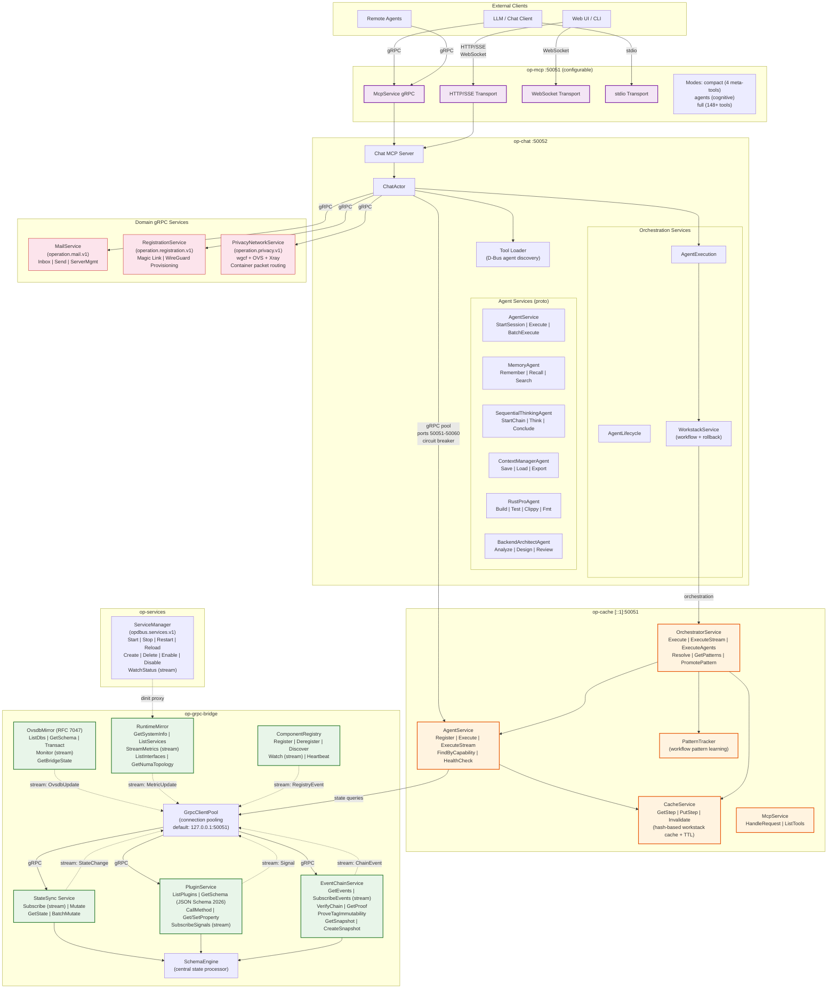
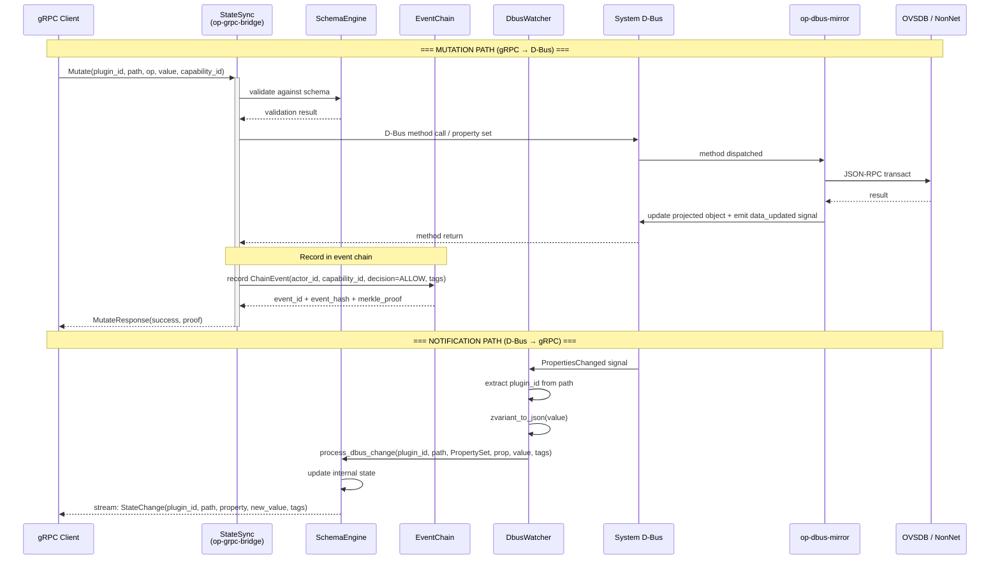
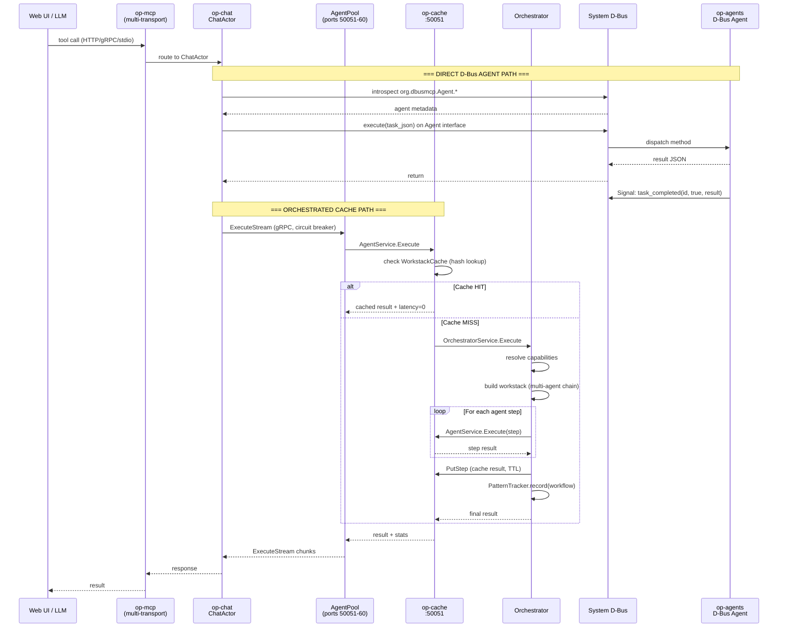

# Operation D-Bus Proto — Traffic Flow Diagrams

## 1. Full gRPC Traffic Flow



---

## 2. Full D-Bus Traffic Flow

```mermaid
flowchart TB
    subgraph dbus_bus["System D-Bus"]
        direction LR
        BUS["org.freedesktop.DBus"]
    end

    subgraph mirror_svc["op-dbus-mirror (org.opdbus.v1)"]
        direction TB
        MIRROR_IF["MirrorV1 Interface\n/org/opdbus/v1\npublish_snapshot | reconcile\nget_stats | list_paths"]

        subgraph projected["Projected Objects"]
            OVSDB_OBJ["ProjectedObjectV1\n/org/opdbus/v1/ovsdb/{table}/{uuid}\njson_data property\nget_property(key)\nSignal: data_updated"]
            NONNET_OBJ["ProjectedObjectV1\n/org/opdbus/v1/nonnet/{db}/{table}/{uuid}\njson_data property\nget_property(key)\nSignal: data_updated"]
            ENT_OBJ["ProjectedObjectV1\n/org/opdbus/v1/state/{entity_id}\njson_data property"]
        end

        subgraph jsonrpc_if["JSON-RPC Interfaces"]
            OVSDB_IF["OvsdbV1 Interface\n/org/opdbus/v1/ovsdb\ntransact | get_schema | list_dbs\ncreate_bridge | delete_bridge\nadd_port | list_bridges | list_ports"]
            NONNET_IF["NonNetV1 Interface\n/org/opdbus/v1/nonnet\ntransact | get_schema | list_dbs"]
        end
    end

    subgraph data_sources["Data Sources (non-D-Bus)"]
        OVSDB_SOCK["OVSDB\n(JSON-RPC socket)\nOpen_vSwitch DB"]
        NONNET_DB["NonNet DB\n(JSON-RPC)"]
        ENT_SQLITE["Enterprise SQLite\n/var/lib/op-dbus/state.db\nlive_objects table"]
    end

    subgraph state_svc["op-state (org.opdbus)"]
        direction TB
        STATE_MGR["StateManager Interface\n/org/opdbus/state\napply_openflow_state(json)\nquery_state() -> JSON\napply_contract_mutation(json)"]

        subgraph plugin_hosts["Plugin D-Bus Hosts"]
            PLUG_HOST["PluginV1 Interface\n/org/opdbus/v1/plugins/{name}\nProperties: name, version, description\nMethods: get_state, get_schema"]
        end

        STATE_MANAGER_INT["StateManager (internal)\nPlugin aggregation\nSchema validation\nDiff + Apply"]
    end

    subgraph agent_svc["op-agents (org.dbusmcp.Agent.*)"]
        direction TB
        AGENT_IF["Agent Interface\n/org/dbusmcp/Agent/{Type}\nexecute(task_json) -> result_json\nrun_operation(op, path, args)\nagent_type | agent_id | name\noperations | status | metadata\nping"]
        AGENT_SIGNALS["Signals:\ntask_completed(task_id, success, result)\nstatus_changed(new_status)"]

        subgraph agent_types["Registered Agent Types"]
            PY_PRO["org.dbusmcp.Agent.PythonPro"]
            RUST_PRO_A["org.dbusmcp.Agent.RustPro"]
            DEBUGGER["org.dbusmcp.Agent.Debugger"]
            MORE_AGENTS["...other agents"]
        end
    end

    subgraph svc_mgr["op-services (org.opdbus.services)"]
        SVC_IF["Manager Interface\n/org/opdbus/services\nstart | stop | restart\nget_status | list_services\nSignal: service_state_changed"]
    end

    subgraph plugin_system["op-plugins"]
        direction TB
        REGISTRY["PluginRegistry\nBuild canonical schema\nCreate PluginCatalogDocument\nPersist to SqlitePluginCatalog\nExport PluginDbusHost"]
        SCHEMA_CAT["SchemaCatalog\n(in-memory indexed schemas)"]
        PUBLISHER["StatePublisher Trait\npublish_change(\n  plugin_id, path, change_type,\n  property, old_value, new_value,\n  tags, source\n)"]

        subgraph state_plugins["State Plugins (examples)"]
            SP_DINIT["dinit"]
            SP_OVSDB["ovsdb_bridge"]
            SP_PRIV["privacy_router"]
            SP_HW["hardware"]
            SP_DNS["dnsresolver"]
            SP_MORE["...30+ plugins"]
        end
    end

    subgraph model_store["op-dbus-model"]
        SQLITE_CAT["SqlitePluginCatalog\nPluginCatalogDocument:\n  schema + dbus_path\n  service_name + storage_path"]
    end

    %% Data source → Mirror
    OVSDB_SOCK -->|"JSON-RPC\nmonitor_db('Open_vSwitch')\nstream updates"| MIRROR_IF
    NONNET_DB -->|"JSON-RPC\nsubscribe() broadcast"| MIRROR_IF
    ENT_SQLITE -->|"SQLite read\nlive_objects"| MIRROR_IF

    %% Mirror publishes objects
    MIRROR_IF -->|"publish_ovsdb_snapshot()"| OVSDB_OBJ
    MIRROR_IF -->|"publish_nonnet_snapshot()"| NONNET_OBJ
    MIRROR_IF -->|"publish_enterprise_snapshot()"| ENT_OBJ

    %% Mirror → D-Bus
    OVSDB_OBJ -->|"Signal: data_updated\nPropertiesChanged"| BUS
    NONNET_OBJ -->|"Signal: data_updated\nPropertiesChanged"| BUS
    ENT_OBJ -->|"PropertiesChanged"| BUS

    %% State manager → D-Bus
    STATE_MGR -->|"register interface"| BUS
    PLUG_HOST -->|"register at\n/org/opdbus/v1/plugins/*"| BUS

    %% Agent services → D-Bus
    AGENT_IF --> BUS
    AGENT_SIGNALS --> BUS
    PY_PRO -->|"request name"| BUS
    RUST_PRO_A -->|"request name"| BUS

    %% Service manager → D-Bus
    SVC_IF -->|"service_state_changed"| BUS

    %% Plugin registration flow
    REGISTRY -->|"persist"| SQLITE_CAT
    REGISTRY -->|"update"| SCHEMA_CAT
    REGISTRY -->|"export PluginDbusHost"| PLUG_HOST
    REGISTRY -->|"publish schema"| PUBLISHER

    %% State plugins use DbusStatePluginBase
    SP_DINIT -.->|"DbusStatePluginBase\nconnect_dbus()"| BUS
    SP_OVSDB -.->|"proxy access"| BUS
    SP_HW -.->|"introspect"| BUS

    %% State manager aggregation
    STATE_MANAGER_INT -->|"query_current_state()\nper plugin"| REGISTRY
    STATE_MANAGER_INT -->|"validate against"| SCHEMA_CAT

    classDef dbus fill:#bbdefb,stroke:#1565c0,stroke-width:2px
    classDef signal fill:#ffecb3,stroke:#ff8f00,stroke-width:2px
    classDef source fill:#c8e6c9,stroke:#2e7d32,stroke-width:1px
    classDef plugin fill:#f3e5f5,stroke:#7b1fa2,stroke-width:1px
    classDef store fill:#fff3e0,stroke:#e65100,stroke-width:1px

    class BUS dbus
    class OVSDB_OBJ,NONNET_OBJ,ENT_OBJ,AGENT_SIGNALS signal
    class OVSDB_SOCK,NONNET_DB,ENT_SQLITE source
    class SP_DINIT,SP_OVSDB,SP_PRIV,SP_HW,SP_DNS,SP_MORE plugin
    class SQLITE_CAT,SCHEMA_CAT store
```



---

## 3. Combined Overlay: gRPC + D-Bus Bridge Points

This diagram shows where the two systems interconnect, with D-Bus in blue and gRPC in green.

```mermaid
flowchart TB
    subgraph external["External (gRPC/HTTP)"]
        UI["Web UI"]
        LLM["LLM Client"]
    end

    subgraph grpc_world["gRPC Domain (green)"]
        style grpc_world fill:#e8f5e9,stroke:#2e7d32

        MCP["op-mcp\ngRPC :50051\nHTTP/WS/stdio"]
        CHAT["op-chat\ngRPC :50052\nAgent orchestration"]
        CACHE["op-cache\ngRPC [::1]:50051\nAgent registry + cache"]

        subgraph grpc_services["gRPC-only Services"]
            MAIL["MailService"]
            REG["RegistrationService"]
            PRIV["PrivacyNetworkService"]
        end
    end

    subgraph bridge["op-grpc-bridge (THE BRIDGE)"]
        style bridge fill:#fff9c4,stroke:#f9a825,stroke-width:3px

        direction TB
        SCHEMA_ENG["SchemaEngine\n(central state processor)"]

        subgraph grpc_face["gRPC-facing Services"]
            SS["StateSync\nSubscribe/Mutate/GetState"]
            PS["PluginService\nListPlugins/GetSchema/CallMethod"]
            EC["EventChainService\nSubscribe/Verify/GetProof"]
            OM["OvsdbMirror\nTransact/Monitor"]
            RM["RuntimeMirror\nMetrics/Services/Interfaces"]
            CR["ComponentRegistry\nDiscover/Watch/Heartbeat"]
        end

        subgraph dbus_face["D-Bus-facing Components"]
            WATCHER["DbusWatcher\nMonitors:\n  /org/opdbus/v1\n  /org/opdbus/v1/ovsdb\n  /org/opdbus/v1/nonnet\nListens: PropertiesChanged\n         custom signals"]
            SYNC_ENG["SyncEngine\nBidirectional state sync"]
        end

        WATCHER -->|"process_dbus_change(\n  plugin_id, path,\n  change_type, value,\n  tags, source\n)"| SCHEMA_ENG
        SCHEMA_ENG --> SS
        SCHEMA_ENG --> PS
        SCHEMA_ENG --> EC
    end

    subgraph dbus_world["D-Bus Domain (blue)"]
        style dbus_world fill:#e3f2fd,stroke:#1565c0

        SYSTEM_BUS["System D-Bus"]

        subgraph dbus_publishers["D-Bus Publishers"]
            MIRROR["op-dbus-mirror\norg.opdbus.v1\nOVSDB + NonNet + Enterprise\nprojection"]
            STATE["op-state\norg.opdbus\nStateManager + PluginV1\nhosts"]
            AGENTS["op-agents\norg.dbusmcp.Agent.*\nPythonPro, RustPro, etc."]
            SERVICES["op-services\norg.opdbus.services\ndinit lifecycle mgmt"]
        end

        subgraph dbus_sources["Underlying Data Sources"]
            OVS["Open vSwitch\nOVSDB socket"]
            NONNET["NonNet DB"]
            SQLITE["Enterprise SQLite"]
            DINIT["dinit\n(service supervisor)"]
            RTNETLINK["rtnetlink\n(kernel networking)"]
        end
    end

    %% External → gRPC
    UI -->|"HTTP/WS"| MCP
    LLM -->|"gRPC/stdio"| MCP
    MCP --> CHAT
    CHAT -->|"agent pool\nports 50051-60\ncircuit breaker"| CACHE

    %% gRPC → Bridge
    CACHE -->|"gRPC client pool"| SS
    CACHE --> PS
    CHAT -->|"tool calls"| PS

    %% Bridge → D-Bus
    WATCHER ===|"zbus connection\nPropertiesChanged\ncustom signals"| SYSTEM_BUS

    %% Mutation path: gRPC → Bridge → D-Bus
    SS -->|"Mutate RPC"| SYNC_ENG
    SYNC_ENG -->|"D-Bus method call\nor property set"| SYSTEM_BUS

    %% D-Bus publishers → Bus
    MIRROR -->|"publish objects\ndata_updated signals"| SYSTEM_BUS
    STATE -->|"PluginV1\nplugin state + schema"| SYSTEM_BUS
    AGENTS -->|"task_completed\nstatus_changed"| SYSTEM_BUS
    SERVICES -->|"service_state_changed"| SYSTEM_BUS

    %% Data sources → Publishers
    OVS -->|"JSON-RPC\nmonitor"| MIRROR
    NONNET -->|"JSON-RPC\nsubscribe"| MIRROR
    SQLITE -->|"SQL read"| MIRROR
    DINIT -->|"dinitctl"| SERVICES
    RTNETLINK -->|"netlink"| RM

    %% Chat → Agents via D-Bus
    CHAT -->|"D-Bus introspection\nagent discovery"| SYSTEM_BUS
    CHAT -->|"execute(task_json)"| AGENTS

    classDef grpc fill:#c8e6c9,stroke:#2e7d32,stroke-width:2px
    classDef dbus fill:#bbdefb,stroke:#1565c0,stroke-width:2px
    classDef bridge_node fill:#fff59d,stroke:#f9a825,stroke-width:2px
    classDef source fill:#f5f5f5,stroke:#616161,stroke-width:1px

    class MCP,CHAT,CACHE,MAIL,REG,PRIV grpc
    class MIRROR,STATE,AGENTS,SERVICES,SYSTEM_BUS dbus
    class WATCHER,SYNC_ENG,SCHEMA_ENG,SS,PS,EC,OM,RM,CR bridge_node
    class OVS,NONNET,SQLITE,DINIT,RTNETLINK source
```



---

## 4. Detailed Sequence: State Mutation (gRPC → D-Bus → gRPC)



---

## 5. Detailed Sequence: Agent Orchestration Flow



---

## 6. Port & Service Summary

| Port | Crate | Services | Transport |
|------|-------|----------|-----------|
| `[::1]:50051` | op-cache | AgentService, CacheService, OrchestratorService | gRPC |
| `[::1]:50051` | op-mcp (default) | McpService (compact/agents/full modes) | gRPC |
| `0.0.0.0:50052` | op-chat | Chat MCP Server | gRPC |
| `50051-50060` | op-chat pool | Per-agent connections (rust_pro, backend_architect, seq_thinking, memory, ctx_mgr, python_pro, debugger, mem0, search, deploy) | gRPC |
| system bus | op-dbus-mirror | MirrorV1, ProjectedObjectV1, OvsdbV1, NonNetV1 | D-Bus |
| system bus | op-state | StateManager, PluginV1 (per plugin) | D-Bus |
| system bus | op-agents | Agent interface (per agent type) | D-Bus |
| system bus | op-services | services.v1.Manager | D-Bus |
| (bridge) | op-grpc-bridge | StateSync, PluginService, EventChainService, OvsdbMirror, RuntimeMirror, ComponentRegistry | gRPC ↔ D-Bus |

---

## 7. D-Bus Object Path Hierarchy

```
/org/opdbus/
├── state                              ← StateManager interface
└── v1/                                ← MirrorV1 interface
    ├── ovsdb/                         ← OvsdbV1 JSON-RPC interface
    │   ├── Bridge/{uuid}              ← ProjectedObjectV1
    │   ├── Port/{uuid}               ← ProjectedObjectV1
    │   ├── Interface/{uuid}           ← ProjectedObjectV1
    │   └── ...per OVSDB table
    ├── nonnet/                        ← NonNetV1 JSON-RPC interface
    │   └── {db_name}/{table}/{uuid}   ← ProjectedObjectV1
    ├── state/{entity_id}              ← ProjectedObjectV1 (enterprise)
    └── plugins/
        ├── dinit/                     ← PluginV1
        ├── ovsdb_bridge/             ← PluginV1
        ├── privacy_router/           ← PluginV1
        ├── hardware/                 ← PluginV1
        └── ...30+ plugins

/org/dbusmcp/Agent/
├── PythonPro                          ← Agent interface
├── RustPro                            ← Agent interface
├── Debugger                           ← Agent interface
└── ...per agent type

/org/opdbus/services                   ← services.v1.Manager interface
```
